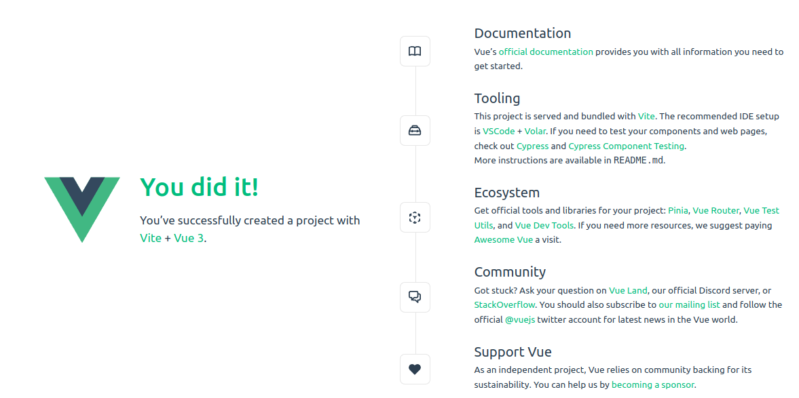

# vue-project

This template should help get you started developing with Vue 3 in Vite.

## Recommended IDE Setup

[VSCode](https://code.visualstudio.com/) + [Volar](https://marketplace.visualstudio.com/items?itemName=Vue.volar) (and disable Vetur) + [TypeScript Vue Plugin (Volar)](https://marketplace.visualstudio.com/items?itemName=Vue.vscode-typescript-vue-plugin).

## Customize configuration

See [Vite Configuration Reference](https://vitejs.dev/config/).

## Project Setup

```sh
npm install
```

### Compile and Hot-Reload for Development

```sh
npm run dev
```

### Compile and Minify for Production

```sh
npm run build
```

### Мой init

````shell
# Эта версия работает на моей версии linux без приколов
# $ uname -a
# Linux vasi-note 5.4.0-150-generic #167~18.04.1-Ubuntu SMP Wed May 24 00:51:42 UTC 2023 
# x86_64 x86_64 x86_64 GNU/Linux
wget https://nodejs.org/dist/v18.14.2/node-v18.14.2-linux-x64.tar.xz

note:/usr/local/bin$ node -v
v16.15.1
note:/usr/local/bin$ npm -v
8.11.0
$ nvm --version
0.32.1
````

Работает. **Запускать в консоли linux (не терминале VS Code) и не от root/sudo**:

````shell
$ npm run dev
````

или так:

````shell
/usr/local/bin/npm run dev
````

Если в терминале VS Code появляется ошибка "node: /lib/x86_64-linux-gnu/libc.so.6: version `GLIBC_2.28' not found (required by node)", то это запуск от **root**.

При установке библиотек (npm install), установку проводить от локального пользователя (**не root и не sudo**). Пример (установка cross-env):

````shell
vue_simple_project$ npm install cross-env
````

[http://localhost:5173/](http://localhost:5173/)



### Ссылки:

[https://v3.vuex.vuejs.org/ru/guide/mutations.html#вызов-мутации-в-компонентах](https://v3.vuex.vuejs.org/ru/guide/mutations.html#вызов-мутации-в-компонентах)<br/>
[https://router.vuejs.org/](https://router.vuejs.org/)
[https://vuejs.org/guide/quick-start.html#creating-a-vue-application](https://vuejs.org/guide/quick-start.html#creating-a-vue-application)<br/>
[https://www.pierrefay.com/vuejs-training/helloworld-tutorial-vuejs.html](https://www.pierrefay.com/vuejs-training/helloworld-tutorial-vuejs.html)<br/>
[https://morioh.com/a/f98df40e9c1a/using-kotlin-spring-boot-and-vuejs-to-make-a-crud-app (okta!)](https://morioh.com/a/f98df40e9c1a/using-kotlin-spring-boot-and-vuejs-to-make-a-crud-app)<br/>
[https://learn.microsoft.com/ru-ru/windows/dev-environment/javascript/vue-beginners-tutorial](https://learn.microsoft.com/ru-ru/windows/dev-environment/javascript/vue-beginners-tutorial)

### Тезисы

[Реактивные ссылки](https://v3.ru.vuejs.org/ru/api/refs-api.html#реактивные-ref-ссылки)
ref - Получает внутреннее значение и возвращает реактивный и мутируемый ref-объект. В этом ref-объекте есть только одно свойство .value, которое указывает на внутреннее значение.

````js
const count = ref(0)
console.log(count.value) // 0

count.value++ // обращение НЕ к count, а к value
console.log(count.value) // 1
````
